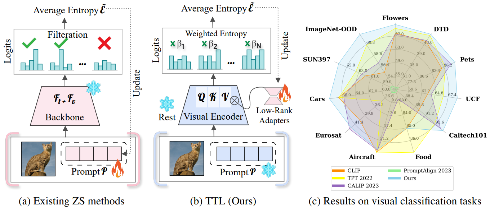
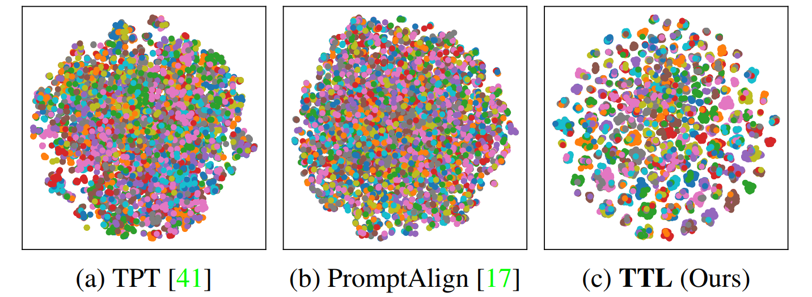

<Test-Time Low Rank Adaptation via Confidence Maximization for Zero-Shot Generalization of ision-Language Models>

This repository provides the official PyTorch implementation of our TTL paper:    

> Test-Time Low Rank Adaptation via Confidence Maximization for Zero-Shot Generalization of Vision-Language Models      
> Authors: *Raza Imam, Hanan Gani, Muhammad Huzaifa, Karthik Nandakumar*  

<p align = "center">

</p>
<p align = "center">
Our proposed TTL vs. Existing zero-shot optimization methods.
</p>

For more details, please check out our [<ins>**paper**</ins>](https://arxiv.org/pdf/2407.15913). 

## Overview
This repository contains the implementation of TTL for image classification with a pre-trained CLIP.
We showed Test-Time (Low-rank) Adaptation *vs* Test-time Prompt Tuning.
We consider the following configurations for TTL:  

* Learnable low-rank weights are initialized with random *Xavier* initialization with rank *r=16*
* Initialized frozen prompts with a hand-crafted prompt as (*e.g.,* "a photo of a ___")


## Prerequisites

### Hardware

This implementation is for the single-GPU configuration. 

To evaluate on ImageNet, ImageNet-V2, and ImageNet-Sketch (which has 1000 classes), you will need a GPU with more than (not including) 16GB memory. This codebase is tested on a GPU with 24GB memory.
To evaluate other datasets (with less than a few hundred classes), a GPU with 16GB memory will work fine. 

### Environment 
The code is tested on PyTorch 2.2.1.

### Datasets 

We suggest downloading all datasets to a root directory (`${DATA_ROOT}`), and renaming the directory of each dataset as suggested in `${ID_to_DIRNAME}` in `./data/datautils.py`. This would allow you to evaluate multiple datasets within the same run.     
If this is not feasible, you could evaluate different datasets separately, and change the `${DATA_ROOT}` accordingly in the bash script.

For out-of-distribution generalization, we consider 5 datasets:

* [ImageNet](https://image-net.org/index.php) 
* [ImageNet-A](https://github.com/hendrycks/natural-adv-examples)
* [ImageNet-R](https://github.com/hendrycks/imagenet-r)
* [ImageNet-V2](https://s3-us-west-2.amazonaws.com/imagenetv2public/imagenetv2-matched-frequency.tar.gz)
* [ImageNet-Sketch](https://github.com/HaohanWang/ImageNet-Sketch)

For cross-datasets generalization, we consider 10 datasets:
* [Flower102](https://www.robots.ox.ac.uk/~vgg/data/flowers/102/102flowers.tgz)
* [DTD](https://www.robots.ox.ac.uk/~vgg/data/dtd/download/dtd-r1.0.1.tar.gz)
* [OxfordPets](https://www.robots.ox.ac.uk/~vgg/data/pets/data/images.tar.gz)
* [StanfordCars](https://ai.stanford.edu/~jkrause/cars/car_dataset.html)
* [UCF101](https://drive.google.com/file/d/10Jqome3vtUA2keJkNanAiFpgbyC9Hc2O/view?usp=sharing)
* [Caltech101](http://www.vision.caltech.edu/Image_Datasets/Caltech101/101_ObjectCategories.tar.gz)
* [Food101](http://data.vision.ee.ethz.ch/cvl/food-101.tar.gz)
* [SUN397](http://vision.princeton.edu/projects/2010/SUN/SUN397.tar.gz)
* [Aircraft](https://www.robots.ox.ac.uk/~vgg/data/fgvc-aircraft/archives/fgvc-aircraft-2013b.tar.gz)
* [EuroSAT](http://madm.dfki.de/files/sentinel/EuroSAT.zip)

For cross-dataset generalization, we adopt the same train/val/test splits as CoOp. Please refer to [this page](https://github.com/KaiyangZhou/CoOp/blob/main/DATASETS.md#how-to-install-datasets), and look for download links of `split_zhou_${dataset_name}.json`, and put the json files under `./data/data_splits/`.


## Run TTL

We provide three bash scripts under `./scripts`. You can modify the paths and other args in the scripts.     

An example to run TTL with LoRA initialization on out-of-distribution datasets:
```
bash ./scripts/test_ttl.sh I/A/V/R/K.
```

The command line arg `${TEST_SETS}` can be multiple test datasets split by "/" (, which are stored under the same root dir `${DATA_ROOT}`).    
Note that for simplicity, we use `set_id` to denote different datasets. A complete list of `set_id` can be found in `${ID_to_DIRNAME}` in `./data/datautils.py`. 


### Main Results

#### Qunatitative Results

<div align="center">

| Method           | ImageNet(IN) | IN-A  | IN-V2 | IN-R  | IN-Sketch | Average | OOD Average |
|------------------|:------------:|:-----:|:-----:|:-----:|:---------:|:-------:|:-----------:|
| [CLIP-ViT-B/16](https://arxiv.org/abs/2103.00020)   |    67.30     | 47.14 | 59.90 | 71.20 |   43.00   |  57.71  |    55.31    |
| Ensemble         |    68.50     | 48.44 | 62.70 | 73.50 |   45.50   |  59.73  |    57.53    |
| [CoOp](https://arxiv.org/abs/2109.01134)   | **72.30** | 49.25 | 65.70 | 71.50 |   47.60   |  61.27  |    58.51    |
| [CoCoOp](https://arxiv.org/abs/2203.05557) |    71.40     | 50.05 | 63.80 | 73.10 |   46.70   |  61.01  |    58.41    |
| [TPT](https://arxiv.org/pdf/2209.07511)    |    68.90     | 54.59 | 63.13 | 77.05 |   47.99   |  62.33  |    60.69    |
| [CALIP](https://arxiv.org/pdf/2209.14169)  |    66.74     | 47.76 | 60.76 | 73.99 |   46.12   |  59.07  |    57.16    |
| [PromptAlign](https://arxiv.org/pdf/2311.01459v2) | 60.02     | 45.52 | 54.53 | 72.84 |   37.72   |  54.13  |    52.65    |
| **TTL (Ours)**   |    70.23     | **60.51** | **64.55** | **77.54** | **48.61** | **64.29** | **62.80** |

</div>
<br />

#### Qualitative Results

**TTL** outperforms various *prompt*-tuning methods in **strict zero-shot** scenarios, including text, visual, and multi-modal prompts. While text *prompt*-tuning like TPT improves zero-shot adaptation, visual and multi-modal methods often underperform without pre-training. Even though PromptAlign shows potential when pre-trained, it struggles without it, reducing its effectiveness in real-world zero-shot tasks. **TTL** excels across all these approaches, achieving better performance without relying on any sort of pre-training.

<p align = "center">

</p>
<p align = "center">
At test-time, TTL produces linearly separable features for zero-shot generalization than existing baselines like TPT, and PromptAlign.
</p>


## Citation
If you find our code useful or our work relevant, please consider citing: 
```
@misc{imam2024testtimelowrankadaptation,
      title={Test-Time Low Rank Adaptation via Confidence Maximization for Zero-Shot Generalization of Vision-Language Models}, 
      author={Raza Imam and Hanan Gani and Muhammad Huzaifa and Karthik Nandakumar},
      year={2024},
      eprint={2407.15913},
      archivePrefix={arXiv},
      primaryClass={cs.CV},
      url={https://arxiv.org/abs/2407.15913}, 
}
```

## Acknowledgements
We thank the authors of [TPT](https://github.com/azshue/TPT/) and [DeYO](https://github.com/Jhyun17/DeYO) for their open-source implementation and instructions on data preparation.